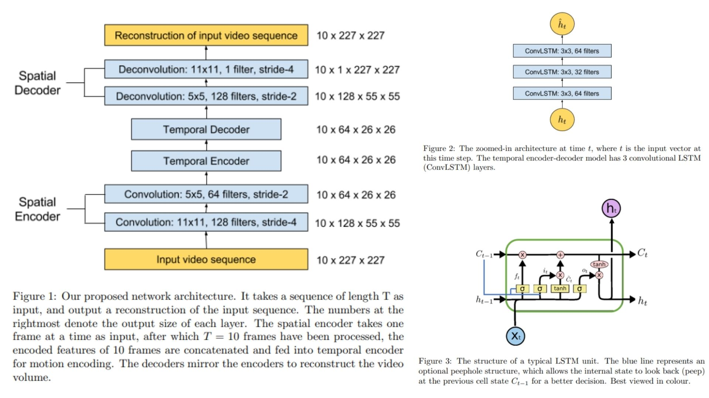

# 🫧 Video-Anomaly-AE – Learning Temporal Regularity via Reconstruction

This repository provides a **clean, minimal, and paper-faithful replication** of a **Video Anomaly Detection Autoencoder** framework.  
The goal is not benchmark dominance, but to **translate the core theoretical ideas of reconstruction-based anomaly detection into an inspectable PyTorch implementation**.

- Learning **normal spatiotemporal patterns** from video 🫙  
- Anomaly detection via **reconstruction error**, not labels 🫐  
- Explicit separation of **spatial encoding** and **temporal modeling** 🧩  
- Modular design for analysis, ablation, and extension 🐢

  
**Paper reference:** [Abnormal Event Detection in Videos
using Spatiotemporal Autoencoder](https://arxiv.org/abs/1701.01546) 🧿

---

## 🌃 Overview – Reconstruction-based Video Anomaly Detection



The core idea is simple but powerful:

A model is trained **exclusively on normal video sequences**.  
At test time, events that **violate learned temporal regularities** lead to poor reconstruction quality.

Pipeline overview:

- Input videos are divided into **fixed-length frame sequences**.  
- Frames are encoded into **compact feature representations** using convolutional encoders.  
- Temporal dynamics are captured via **recurrent or spatiotemporal modules**.  
- The decoder attempts to **reconstruct the original input frames**.  
- Regions or time steps with **high reconstruction error** are treated as **anomaly candidates**.

The figures in the original papers highlight the contrast between temporal prediction and reconstruction, show **error spikes during abnormal events**, and visualize how temporal regularity is preserved in latent representations under normal conditions.

---

## 📐 Core Mathematical Formulation

A video clip is represented as a sequence of frames:
$$X = \{x_1, x_2, \dots, x_T\}, \quad x_t \in \mathbb{R}^{C \times H \times W}$$

Each frame is mapped to a latent representation by a convolutional encoder:
$$z_t = f_{\text{enc}}(x_t)$$

The decoder reconstructs the input frame from the latent representation:
$$x_t^{\text{rec}} = f_{\mathrm{dec}}(z_t)$$

Normality is defined through the reconstruction error:
$$\mathcal{L}_{\text{rec}} = \| x_t - x_t^{\text{rec}} \|_2^2$$

At inference time, the anomaly score for each frame is given by:
$$S_t = \mathcal{L}_{\text{rec}}$$

Higher values of $S_t$ indicate deviations from learned normal behavior.


---

## 🧠 What the Model Learns

Despite its simplicity, this paradigm captures rich structure:

- Encoders learn **appearance statistics** of normal scenes.  
- Temporal modules enforce **smooth evolution** across time.  
- Decoders expose failures when motion, objects, or dynamics deviate.

In practice:

Normal events reconstruct quietly 🌙  
Abnormal events leave loud reconstruction scars   

No explicit anomaly labels are required — the signal emerges from structure alone.

---

## 📦 Repository Structure

```bash
Video-Anomaly-AE/
├── src/
│   ├── layers/
│   │   ├── conv_block.py          # Conv2D + activation (+ optional pooling)
│   │   ├── deconv_block.py        # ConvTranspose2D decoder blocks
│   │   ├── convlstm_layer.py      # Temporal modeling via ConvLSTM
│   │   └── utils_layers.py        # weight init & shape helpers
│   │
│   ├── blocks/
│   │   ├── encoder_block.py       # Spatial encoder stacks
│   │   ├── temporal_block.py      # Latent temporal consistency
│   │   └── decoder_block.py       # Frame reconstruction
│   │
│   ├── model/
│   │   └── anomaly_ae.py          # Full autoencoder model
│   │
│   └── config.py
│
├── images/
│   ├── figmix.jpg
│   └── figmix2.jpg
│
├── requirements.txt
└── README.md
```
---


## 🔗 Feedback

For questions or feedback, contact: [barkin.adiguzel@gmail.com](mailto:barkin.adiguzel@gmail.com)
